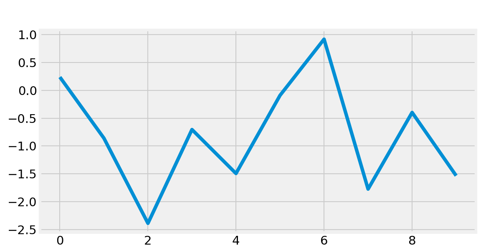

+++
title = "Matplotlib で図の余白のみを透明にする"
date  = 2019-02-11T16:00:09+09:00
tags  = ["Python", "matplotlib", "Visualization"]
categories  = ["Tech"]
toc = true
aliases = ["/blog/26/"]
+++

## TL;DR :snowman:

Matplotlib でプロット以外の余白部分を透明にした図を保存する際のメモです。
何も考えずに `plt.savefig()` で `transparent=True` としてしまうと、以下のようにプロット部分も透明になってしまいます。

| `transparent=False` | `transparent=True` |
| --- | --- |
|  |  |

この挙動は、`plt.savefig()` の docstrings にも書かれています。

> If *True*, the axes patches will all be transparent;
> the figure patch will also be transparent unless facecolor and/or edgecolor are specified via kwargs.
> This is useful, for example, for displaying a plot on top of a colored background on a web page.
> The transparency of these patches will be restored to their original values upon exit of this function.

## Make only margins transparent

そこで、`transparent` を指定するのではなく、図全体の背景となるオブジェクト (`fig.patch`) を明示的に透明にしてしまうことにします。
これは、以下のようなコードで実現できるはずです。

```python
import matplotlib.pyplot as plt
plt.style.use('fivethirtyeight')

# make fig, axes and plot something
fig, ax = plt.subplots(...)
ax.plot(...)

# make figure's background tranparent
fig.patch.set_alpha(0)

# save figure
fig.savefig(...)
```

これの結果は以下の通りです。
余白部分だけが透明になっており、プロットの部分は指定したスタイル通りの色が付いていることが確認できました。

| `transparent=False` | `patch.set_alpha(0)` |
| --- | --- |
|  |  |

## References

+ [早く知っておきたかったmatplotlibの基礎知識、あるいは見た目の調整が捗るArtistの話 \- Qiita](https://qiita.com/skotaro/items/08dc0b8c5704c94eafb9)
